# Question file format

Use this to hand OmniTrivia your own questions instead of generating them.
**No API key is needed for this path.**

> [!TIP]
> **Start from the template.** [`questions.template.xlsx`](questions.template.xlsx)
> ([download](https://github.com/OmniFlexFitness/OmniTrivia/raw/master/questions.template.xlsx))
> opens in Excel or Google Sheets with one question of every format on its
> first tab, a drop-down for the format and a note on every column. Overwrite
> the examples, then bring the file in by any of the routes under
> **Getting it into OmniTrivia**.

> [!NOTE]
> Not sure you want to write any? **HOST GAME → USE THE QUESTION BANK** loads
> several hundred premade questions and needs none of this. The bank is just a
> sheet in this format, so everything below describes it too — and if you want
> to extend it, this is the shape to add rows in.

Every picture in this guide is the real thing. The sheet pictures are the
template's own rows. The play pictures are the same questions played through
the app, as a player's phone, the big screen and the answer key show them.

## The template

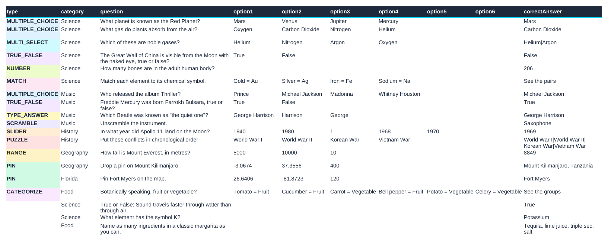

`questions.template.xlsx` has three tabs.

| Tab | What it is for |
|---|---|
| **Questions** | The questions, one per row, under a row of headings. This is the tab the app reads, so it stays first and holds nothing but questions. |
| **How to use** | Which cells to fill in, and how to get the file into the app. |
| **Question types** | A line per format: what goes in the option and `correctAnswer` columns, the clock, the scoring, and the other spellings the `type` column takes. |

- **Overwrite the example rows and keep row 1.** The headings are how the app
  finds each column.
- **The `type` column has a drop-down** of the twelve formats. Each type cell
  takes the colour the review screen gives that format's badge, so a sheet of
  mixed formats reads down the first column.
- **Hover a heading** for a note on what that column is for.
- [`questions.example.csv`](questions.example.csv) is the same rows as a
  plain CSV file.

## Getting it into OmniTrivia

There are three ways in, all on **HOST GAME → IMPORT MY OWN QUESTIONS**.

### A CSV file

Save the sheet as CSV and choose it with **Select File**. A CSV file is read
entirely in the browser and makes no network calls at all, so it is the route
that works on any venue's Wi-Fi, or none.

- **From Excel:** **File → Save As → CSV UTF-8 (Comma delimited)**, with the
  Questions tab open. Plain **CSV (Comma delimited)** mangles dashes, accents,
  curly quotes and `°`.
- **From Google Sheets:** **File → Download → Comma-separated values (.csv)**,
  or **Tab-separated values (.tsv)**. Either saves only the tab that is open.

Commas, semicolons and tabs between cells all work: the app reads which one
the file uses off its header row. So a `.tsv` file imports, and so does a CSV
that Excel wrote with semicolons, which it does where the decimal mark is a
comma.

> [!WARNING]
> **Numbers need a decimal point.** The app never guesses which way a number
> was meant. One that could be read two ways leaves its question out as *a
> number reads two ways*: a decimal comma (`26,6406`, `3,14`) or a band
> written with a comma (`1968,1970`) in any file, and in a file separated by
> semicolons or tabs any comma in a number (`3,142`), and with semicolons a
> point before three digits too (`10.000`, `1.609`). Only cells read as
> numbers count; text is left exactly as written. Where Excel writes decimal
> commas, format the number columns as text and type the numbers with points.

### A Google Sheet

Paste the sheet's URL on the import screen instead. Sharing must be set to
**"Anyone with the link can view"** — the app fetches
`.../export?format=csv`. The same column rules apply.

- **Put one quiz per tab and link the tab you want:** open that tab, then copy
  the URL from the address bar. It ends in `gid=<number>`, and the app reads
  that tab.
- **A link with no `gid=`** (the kind the **Share** button copies) reads tab 0:
  the tab a sheet made in Google Sheets starts with, wherever it has since been
  moved. If there is no tab 0, the app reads the leftmost tab instead.

A Google Sheet is fetched from `docs.google.com` when you import it, so it
needs internet access at that moment. Download a CSV beforehand if the venue's
Wi-Fi is unreliable.

### An Excel file in Google Drive

Upload the `.xlsx` to Drive, share it as **"Anyone with the link can view"**,
and paste its share link. Opening a `.xlsx` from Drive shows it in Sheets
without converting it. Its share link looks like
`.../edit?usp=sharing&ouid=...&rtpof=true&sd=true`, with no `gid=`, and its
tabs have long random ids instead of 0, so the app reads its first tab. That is
why the template's Questions tab comes first.

To read a different tab, open that tab and copy the URL. If anything about the
file gives trouble, use **File → Save as Google Sheets** and link the copy.

> [!NOTE]
> This is exactly how the built-in question bank is served. To make a sheet of
> your own the app's default, point `DEFAULT_QUESTION_BANK` in
> `src/constants.ts` at it and run `npm run check-question-bank` to confirm
> every row still parses.

## How a row becomes a question

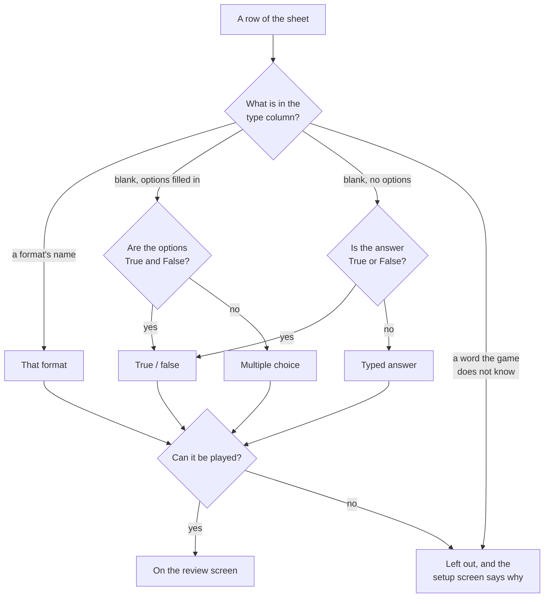
```mermaid
flowchart TD
    row["A row of the sheet"] --> type{"What is in the<br>type column?"}
    type -->|"a format's name"| named["That format"]
    type -->|"blank, options filled in"| tfOptions{"Are the options<br>True and False?"}
    tfOptions -->|yes| tf["True / false"]
    tfOptions -->|no| mc["Multiple choice"]
    type -->|"blank, no options"| tfAnswer{"Is the answer<br>True or False?"}
    tfAnswer -->|yes| tf
    tfAnswer -->|no| typed["Typed answer"]
    type -->|"a word the game<br>does not know"| out
    named & tf & mc & typed --> check{"Can it be played?"}
    check -->|yes| review["On the review screen"]
    check -->|no| out["Left out, and the<br>setup screen says why"]
```

### The columns

The first row must be a header. Column names are matched ignoring case and
spaces, so `Correct Answer`, `correctanswer` and `correctAnswer` are all the
same column. Underscores and hyphens are not ignored: `correct_answer` is not
`correctAnswer`. Order does not matter, and any column not listed here is
skipped, so a `notes` column is fine.

| Column | Required | Purpose |
|---|---|---|
| `category` | **yes** | Groups questions into rounds — one category per spin of the wheel |
| `question` | **yes** | What players read |
| `correctAnswer` | **yes** | The answer. What form it takes depends on `type` |
| `type` | no | The format. Blank is multiple choice, or the **shorthand** |
| `option1` … `optionN` | no | Meaning depends on `type`. Add as many as a question needs: `option7`, `option8` and on are read too |
| `explanation` | no | Shown with the answer after the round |
| `image` | no | A picture with the question: an `https://` link, or `world` / `usa` for a built-in map. Required for a `PIN` question, where it is what gets pinned |
| `margin` | no | How much a near miss on a `SLIDER`, `NUMBER` or `PIN` question still scores: `none`, `low`, `medium`, `high` or `maximum` |
| `unit` | no | What a `SLIDER`, `RANGE` or `NUMBER` answer counts, shown after the number: `km`, `°F`, `years` |
| `timeLimit` | no | Seconds on the clock for this question, 5 to 120. Each format has its own default |

The optional columns answer to a few other names: `picture`, `image url`,
`media` or `map` for `image`; `accuracy` or `margin of accuracy` for `margin`;
`units` for `unit`; and `time`, `seconds` or `timer` for `timeLimit`.

**Rules for every row:**

- **`category`, `question` and `correctAnswer` must all have something in
  them**, even for a format that does not grade the answer column. A row
  missing one is left out.
- **Option columns are read left to right with the empty ones skipped.** For
  most formats that does not matter. For a slider or a pin, where position is
  meaning, an empty cell before a filled one moves everything after it along
  one.
- **Option columns must be named `option1`, `option2` and so on** (`Option 1`
  works). Columns named `Option A`, `Option B` are not read at all.
- **Placeholder text leaves a question out**: a question starting with
  `Placeholder`, `TBD`, `TODO` or `Lorem ipsum`, or an option like `Option B`,
  `Answer 3`, `TBD` or `??`.
- **`timeLimit` reads the first number in the cell**, so `45` and `45s` both
  work, and a value outside 5 to 120 is pulled in to the nearest end when the
  question is played.

**Categories.** Each distinct category becomes one category the wheel can land
on. A category matching a built-in name — **Science, History, Geography, Pop
Culture, Sports, Tech, Art, Literature, Music, Food** — gets that category's
icon and colour on the wheel (and `Entertainment` joins Pop Culture). Any other
name works and gets an icon and colour of its own. Names that differ only in
capitals or spaces are one category.

**The order in the file is not the order it is played.** After the file is
read you are shown **WHAT TO PLAY**: tick the categories you want, and the
rounds and questions-per-round numbers you set on the setup screen trim the
rest away. Whatever survives is shuffled — categories, the questions inside
each one, and the options under each multiple-choice and select-all question —
and which category comes up in which round is then decided by the wheel, live.
So a file can hold far more than one night's worth, and the same file gives a
different game each time.

## Choosing a format

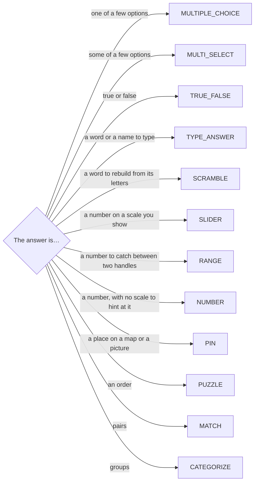
```mermaid
flowchart LR
    answer{"The answer is…"}
    answer -->|"one of a few options"| MULTIPLE_CHOICE
    answer -->|"some of a few options"| MULTI_SELECT
    answer -->|"true or false"| TRUE_FALSE
    answer -->|"a word or a name to type"| TYPE_ANSWER
    answer -->|"a word to rebuild from its letters"| SCRAMBLE
    answer -->|"a number on a scale you show"| SLIDER
    answer -->|"a number to catch between two handles"| RANGE
    answer -->|"a number, with no scale to hint at it"| NUMBER
    answer -->|"a place on a map or a picture"| PIN
    answer -->|"an order"| PUZZLE
    answer -->|"pairs"| MATCH
    answer -->|"groups"| CATEGORIZE
```

| `type` | What players do | Clock | Scoring | Also accepted in the `type` column |
|---|---|---|---|---|
| `MULTIPLE_CHOICE` | Tap one option | 15s | All or nothing | `MC`, `MCQ`, `Multiple`, `Quiz`, `Choice`, `Single select`, `Single choice`, or leave it blank |
| `MULTI_SELECT` | Tick every right option | 20s | A wrong tick cancels a right one | `Select all that apply`, `Multi-select`, `Multiple select`, `Checkbox`, `Checkboxes`, `Multiple answer` |
| `TRUE_FALSE` | Tap True or False | 12s | All or nothing | `TF`, `T/F`, `True/False`, `True or False`, `True / false`, `Boolean`, `Fact or fiction` |
| `TYPE_ANSWER` | Type the answer | 20s | All or nothing | `Typed answer`, `Type answer`, `Typed`, `Text`, `Short answer`, `Fill in the blank`, `Open`, `Open-ended`, `Text input`, `Free text` |
| `SLIDER` | Slide to a number | 20s | Inside the target scores in full; `margin` pays a near miss | `Slide`, `Scale` |
| `RANGE` | Drag two handles to catch the answer | 20s | The tighter the catch, the more it pays | `Range slider`, `Bracket`, `Interval`, `Between` |
| `NUMBER` | Type a number, no scale shown | 20s | Exact scores in full; `margin` pays a near miss | `Closest`, `Closest number`, `Closest guess`, `Estimate`, `Numeric`, `Guess`, `Nearest` |
| `PIN` | Drop a pin on a map or a picture | 25s | Inside the ring scores in full; `margin` pays a near miss | `Pin answer`, `Drop pin`, `Map`, `Map pin`, `Hotspot`, `Pin it` |
| `PUZZLE` | Put items in order | 30s | All or nothing | `Puzzle · order`, `Order`, `Sequence`, `Sort order`, `Rank`, `Timeline` |
| `MATCH` | Pair items with their partners | 30s | Pays for every pair right beyond guessing | `Puzzle · match`, `Matching`, `Pairs`, `Pair`, `Connect`, `Match up` |
| `CATEGORIZE` | Sort items into groups | 30s | Pays for every item right beyond guessing | `Puzzle · sort`, `Categorise`, `Sort`, `Group`, `Groups`, `Buckets`, `Classify` |
| `SCRAMBLE` | Rebuild a word from shuffled letters | 25s | All or nothing | `Puzzle · unscramble`, `Unscramble`, `Anagram`, `Word scramble`, `Jumble` |

The `type` column ignores capitals, and treats spaces, `/`, `&`, `-` and `·` as
the same thing, so `True/False`, `true or false` and `TRUE_FALSE` all work.
Every name the app shows for a format works too: the headings below and the
badges on the review screen (`Typed answer`, `Puzzle · order`, `Multi-select`).

> [!CAUTION]
> **A word the game does not know leaves the row out**, and the setup screen
> gives the word: `unknown format "Quizz"`. It is not guessed at, so a typo in
> the `type` column is never played as some other format. A `-` or `N/A`
> counts as blank. `Sort` means `CATEGORIZE`, not putting things in order. Use
> the template's drop-down and none of this comes up.

**Points.** A right answer is worth 100 plus up to 150 for speed — ten a second
on a fifteen-second question, scaled so that a full clock is worth the same on
every format. A near miss earns its share of that, and is shown as **≈ close**
rather than ✓: it scores, but it is not a right answer and does not keep a
streak going. The last question of a round counts double.

**What players are told.** A phone shows the question, the clock and the
answer controls; it never names the format, and never says whether an answer
was right until that player's match is over. The big screen shows the question
to the room while anyone is still on it. The answers go up on the big screen,
as an answer key, when the round ends.

## The formats

### Multiple choice · `MULTIPLE_CHOICE`

Players tap one option. It is the default: a row with options and no `type`
is multiple choice.

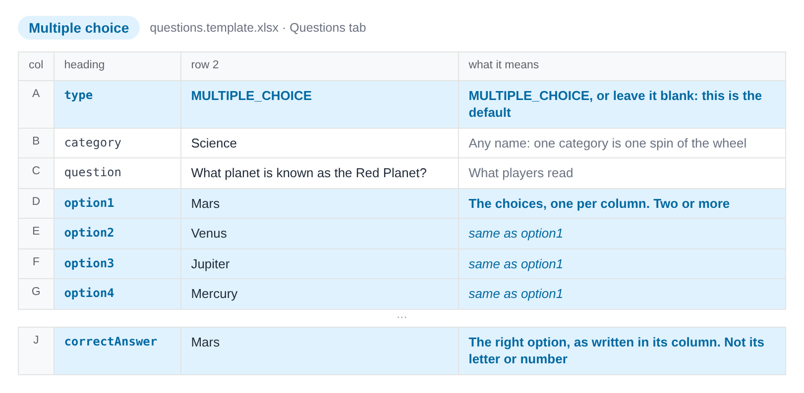

- **The options are the choices**, one per column: two or more. Four reads
  best on a phone.
- **`correctAnswer` is the right option, written the way it is in its
  column.** Capitals and extra spaces do not matter.
- An answer written a little more fully than its option still finds it, as
  long as only one option can be meant, the option is there in whole words
  (`USA` is not found in Jerusalem), and the part that matches is more than a
  letter, a two-letter code or a number:

| `correctAnswer` | Options | Marks |
|---|---|---|
| `The Nile` | Amazon, Nile, Mississippi, Yangtze | Nile |
| `Tampa (Ybor City)` | Jacksonville, Tampa, Miami, Key West | Tampa |
| `Old Town Road by Lil Nas X` | Shape of You, Despacito, Old Town Road, Rockstar | Old Town Road |

```csv
type,category,question,option1,option2,option3,option4,correctAnswer,explanation
MULTIPLE_CHOICE,Science,What planet is known as the Red Planet?,Mars,Venus,Jupiter,Mercury,Mars,Iron oxide gives Mars its colour.
```

> [!WARNING]
> **Write the answer itself, not the option's letter or number.** The options
> are shuffled, so there is no "B". An answer of `B`, `b)`, `(2)` or `Option 3`
> leaves the question out as *the answer is an option's letter or number*. A
> letter or a number is never matched to an option it is part of: `B` against
> Boston, Chicago, Denver, Austin does not mark Boston, and `1` against 10, 20,
> 30, 40 does not mark 10. Write a number formatted the way its option is:
> `1,000` does not match `1000`.

An answer that matches no option, or could mean two of them (`Mars and
Venus`), leaves the question out, and the setup screen says so.

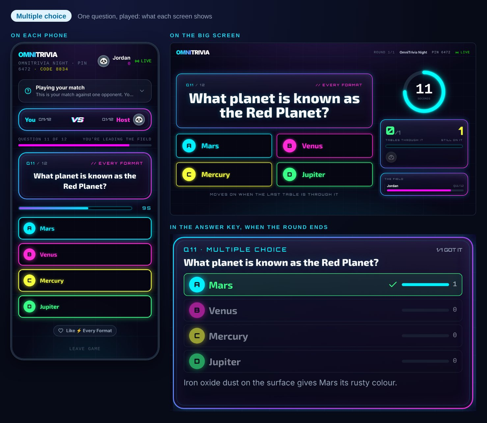

A tap is final: there is no lock button. The answer key shows how many people
picked each option.

### Select all that apply · `MULTI_SELECT`

Players tick every right option, then lock it in. They are not told how many
are right — that is the question.

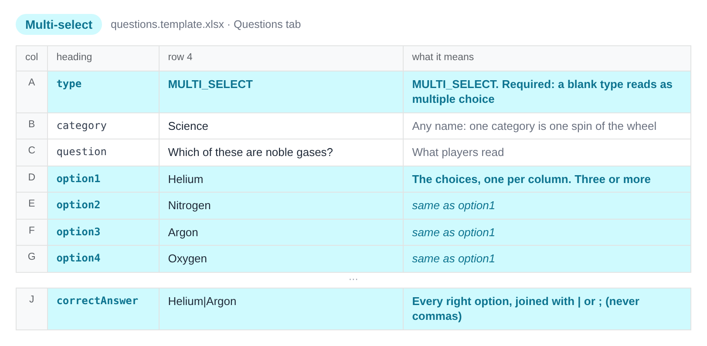

- **The options are the choices**: three or more.
- **`correctAnswer` lists every right option, joined with `|`** (or `;`). One
  right option, or all of them, is allowed.
- **The `type` column is required.** With it blank the row is read as multiple
  choice, `Helium|Argon` matches no single option, and the question is left
  out.

```csv
type,category,question,option1,option2,option3,option4,correctAnswer,explanation
MULTI_SELECT,Science,Which of these are noble gases?,Helium,Nitrogen,Argon,Oxygen,Helium|Argon,Both have full outer shells.
```

> [!WARNING]
> **Commas do not separate answers.** `Helium, Argon` is read as one answer,
> which matches nothing and leaves the question out — or, worse, `Helium,
> Xenon` quietly marks only Helium right.

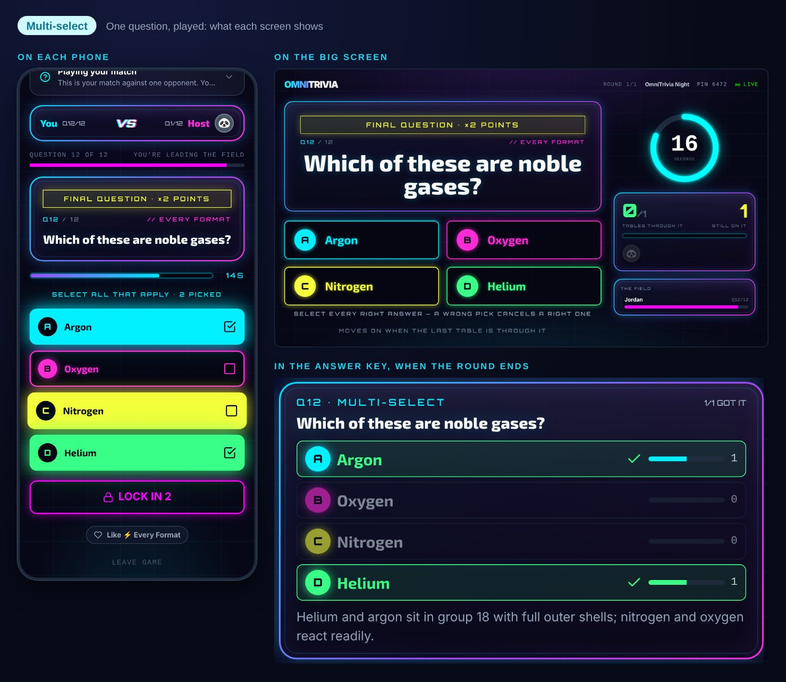

Full points only for exactly the right options. Otherwise each right tick
earns its share and each wrong tick cancels one, so ticking everything is
worth nothing. With Helium and Argon right:

| Ticked | Scores |
|---|---|
| Helium, Argon | Full points ✓ |
| Helium | Half ≈ |
| Helium, Argon, Nitrogen | Half ≈ |
| Helium, Nitrogen | Nothing |
| All four | Nothing |

### True or false · `TRUE_FALSE`

Players get two big buttons — ✓ True and ✕ False — and on a keyboard, T and F.

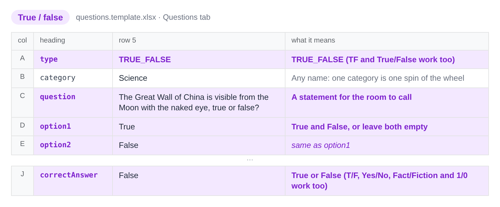

- **The options are always True and False**, whatever you write. Write them,
  or leave them empty.
- **`correctAnswer` is `True` or `False`.** `T`, `F`, `Yes`, `No`, `Y`, `N`,
  `Fact`, `Fiction`, `Correct`, `Incorrect`, `Myth`, `1` and `0` work too.
- **The `type` column can be left blank** two ways: give exactly two options
  that are `True` and `False`, or give no options at all and an answer of
  exactly `True` or `False` (the **shorthand**).

```csv
type,category,question,option1,option2,correctAnswer,explanation
TRUE_FALSE,Science,"The Great Wall of China is visible from the Moon with the naked eye, true or false?",True,False,False,It is not even reliably visible from low Earth orbit.
```

The question has a comma in it, so the CSV puts it in quotes. A spreadsheet
does that for you when it saves.

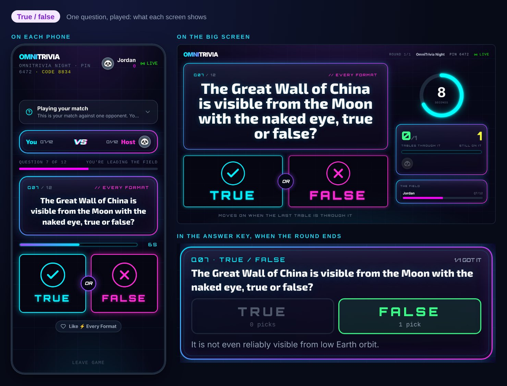

All or nothing. A tap is final.

### Typed answer · `TYPE_ANSWER`

Players type the answer on their phone.

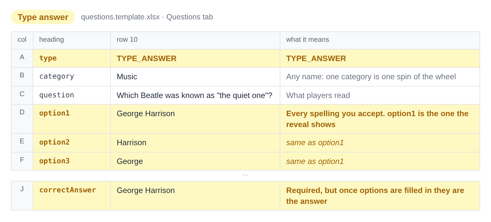

- **The options are every spelling you will accept**, one per column.
  `option1` is the one the answer key shows, so put the best-written one first.
- **Once the options are filled in, they are the whole list.** `correctAnswer`
  is not added to them, so repeat it as an option. The column still cannot be
  blank.
- **Matching ignores capitals, and spaces at the ends or doubled in the
  middle.** Nothing else: `George Harrison.` with a full stop, `Beatles` for
  `The Beatles` and `Pele` for `Pelé` are all wrong. List the variants you will
  take.
- **Leave the options empty** and the accepted spellings are worked out from
  `correctAnswer` instead — see the **shorthand**.

```csv
type,category,question,option1,option2,option3,correctAnswer,explanation
TYPE_ANSWER,Music,"Which Beatle was known as ""the quiet one""?",George Harrison,Harrison,George,George Harrison,He wrote Something and Here Comes the Sun.
```

In the spreadsheet that question is just `Which Beatle was known as "the
quiet one"?`. The doubled quotes are how a CSV file writes a quote inside a
quoted cell, and a spreadsheet writes them for you.

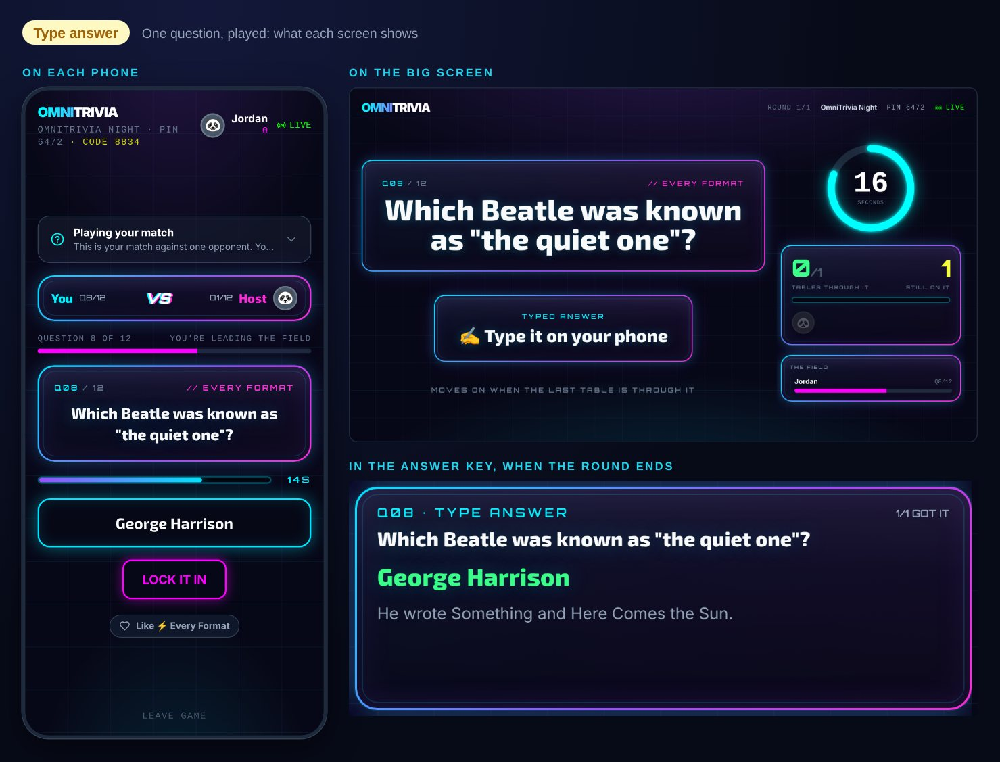

All or nothing.

### Slider · `SLIDER`

Players drag to a number on a scale, then lock it in.

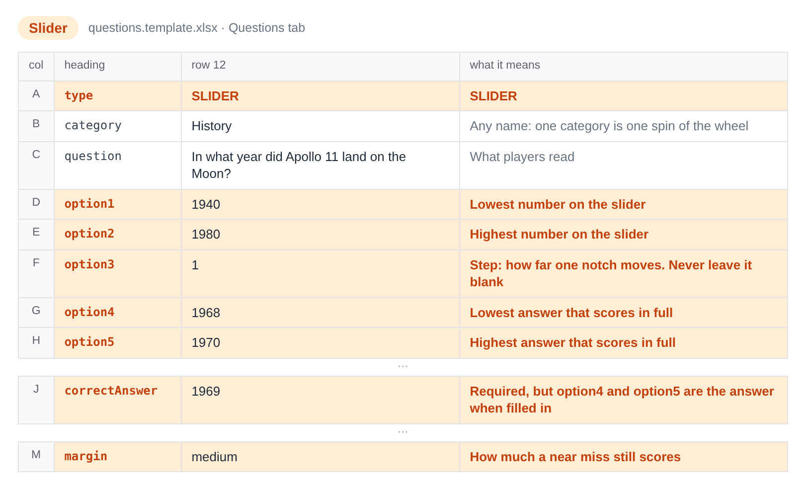

- **The options are positions:** `option1` the lowest number on the slider,
  `option2` the highest, `option3` the step (how far one notch moves),
  `option4` and `option5` the lowest and highest answer that score in full.
  Anything from `option4` to `option5`, both included, scores in full.
- **With `option4` and `option5` filled in, `correctAnswer` is not graded**,
  but it cannot be blank: write the answer.
- **The shorter way:** give only the lowest, highest and step, and put the
  answer — or a band like `1968-1970` or `1968 to 1970` — in `correctAnswer`.
  In this form the step can be blank too: 1 for whole numbers, 0.1 otherwise.
- **`unit` puts a unit after the number.** Leave it blank for years: a year
  shows as `1969` with no unit and as `1,969 years` with one.

```csv
type,category,question,option1,option2,option3,option4,option5,correctAnswer,explanation,margin
SLIDER,History,In what year did Apollo 11 land on the Moon?,1960,1980,1,1968,1970,1969,Apollo 11 touched down on 20 July 1969.,medium
SLIDER,History,In what year did Apollo 11 land on the Moon?,1960,1980,1,,,1968-1970,Apollo 11 touched down on 20 July 1969.,medium
```

> [!CAUTION]
> **Never leave `option3` blank when `option4` and `option5` are filled in.**
> Empty option cells are skipped, so `1960, 1980, (blank), 1968, 1970` reads
> as a step of 1968, and the slider can only stop at 1960 or 1980. Two more
> mistakes the importer cannot catch for you: `option4` must not be above
> `option5` (the question is left out as "slider is missing its scale"), and
> the target has to sit on the step — a 0–100 slider in steps of 10 can never
> land on 15, so nobody scores in full.

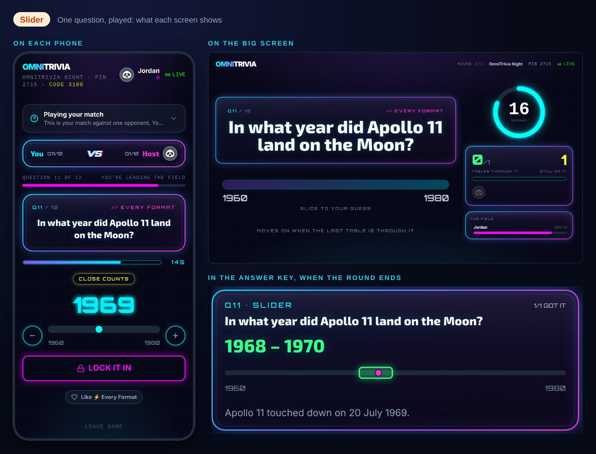

The slider starts in the middle of its scale, and players can nudge it a step
at a time. The `margin` column decides what a near miss is worth, the way
Kahoot's "margin of accuracy" does. Credit falls in a straight line from full
at the edge of the target to nothing at the edge of the margin, measured as a
share of the slider's whole scale:

| `margin` | A miss still scores within… | On 1960–1980, target 1968–1970: 1971 | 1972 | 1975 | 1980 |
|---|---|---|---|---|---|
| `none` (default) | nothing — inside the target or no points | 0 | 0 | 0 | 0 |
| `low` | 5% of the scale | 0 | 0 | 0 | 0 |
| `medium` | 15% of the scale | 67% | 33% | 0 | 0 |
| `high` | 30% of the scale | 83% | 67% | 17% | 0 |
| `maximum` | the whole scale — every answer scores, closer scores more | 95% | 90% | 75% | 50% |

On a narrow scale `low` buys nothing: 5% of 20 years is one year, and a miss
of exactly the margin scores nothing. Widen the scale or raise the margin.

### Range · `RANGE`

Players drag **two** handles to catch the answer between them, then lock it
in. The tighter the catch, the more it pays.

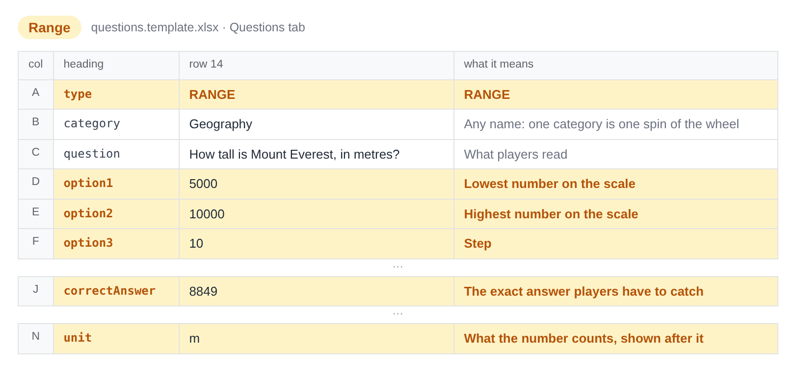

- **The options are a slider's first three:** lowest, highest, step.
- **`correctAnswer` is the exact answer.** A band (`8800-8900`) works too, as
  does `option4` and `option5` the way a slider takes them.
- **`margin` does nothing on a range** — the width of the catch is the margin.

```csv
type,category,question,option1,option2,option3,correctAnswer,explanation,unit
RANGE,Geography,"How tall is Mount Everest, in metres?",5000,10000,10,8849,Surveyed at 8848.86 m in 2020.,m
```


The handles start at 30% and 70% of the scale. While dragging, players see a
meter of what their range would be worth if the answer is inside it — worked
out from its width alone, so it gives nothing away.

| The answer is inside a range as wide as… | Scores |
|---|---|
| a tenth of the scale or less | Full points ✓ |
| a fifth | 80% ✓ |
| two fifths | 40% ✓ |
| half | 20% ✓ |
| more than half, or the answer is outside it | Nothing |

A range that catches the answer counts as right at any of those prices. Choose
a scale wide enough that the answer is not obvious from it.

### Closest number · `NUMBER`

Players type a number, with no scale to hint at where it is.

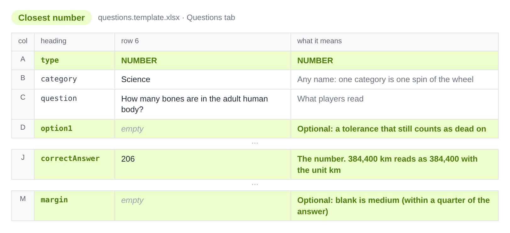

- **`correctAnswer` is the number.** Commas and a unit after it are fine:
  `384,400 km` reads as 384,400 with the unit `km`. Write decimals with a
  point: a number that could be read two ways, like `26,6406`, leaves the
  question out (see **A CSV file**).
- **A tolerance is optional:** the first option you fill in. Anything within
  it counts as dead on.
- **The `type` column is required.** With it blank and no options, a number in
  `correctAnswer` makes a typed-answer question instead.

```csv
type,category,question,option1,correctAnswer,explanation,margin
NUMBER,Science,How many bones are in the adult human body?,,206,Babies start with closer to 300.,
NUMBER,Space,"How far is the Moon from Earth, on average?","1,000","384,400 km",Measured centre to centre.,high
```


The margin is measured as a share of the answer itself, so 25% of 384,400 km
is a lot more room than 25% of 7. The default is `medium`:

| `margin` | A miss still scores within… | For 206: a guess of 200 | 180 | 250 |
|---|---|---|---|---|
| `none` | nothing (or the tolerance) | 0 | 0 | 0 |
| `low` | 10% of the answer | 71% | 0 | 0 |
| `medium` (default) | 25% of the answer | 88% | 50% | 15% |
| `high` | 50% of the answer | 94% | 75% | 57% |
| `maximum` | 100% of the answer | 97% | 87% | 79% |

Scoring is against the answer, not the room: the closest guess in the room
still scores nothing outside the margin, and even `maximum` stops at double
the answer.

### Pin answer · `PIN`

Players drop a pin on a picture — tap to place it, tap again to move it,
pinch, scroll or press + to zoom in, drag to pan. Inside the ring scores in
full; the `margin` pays for a near miss, and is `low` unless the row says
otherwise. The answer key draws the ring, the margin around it, and every pin
the room dropped.

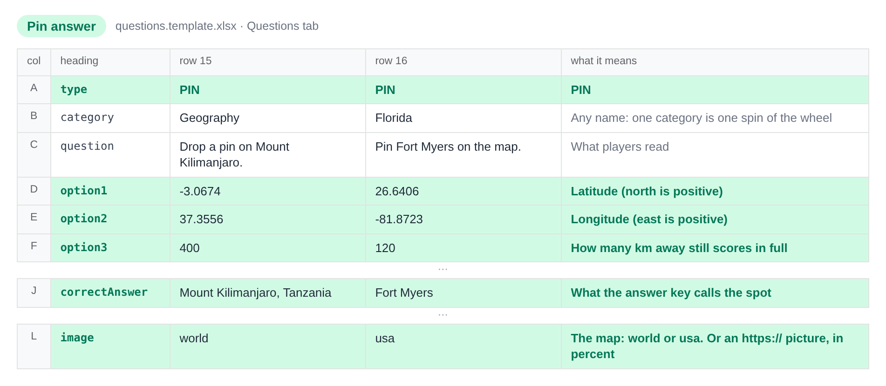

**On a built-in map**, set `image` to `world` (the world, from 84°N to 58°S)
or `usa` (the lower 48 states), and the options are **latitude, longitude, and
how many kilometres away still scores in full** — no pixels to measure.
Latitude is positive north of the equator, longitude positive east of
Greenwich.

```csv
type,category,question,option1,option2,option3,correctAnswer,explanation,image
PIN,Geography,Drop a pin on Mount Kilimanjaro.,-3.0674,37.3556,400,"Mount Kilimanjaro, Tanzania",Africa's highest peak.,world
PIN,Florida,Pin Fort Myers on the map.,26.6406,-81.8723,120,Fort Myers,Edison wintered here.,usa
```

- The radius defaults to 500 km on the world map and 150 km on the US map.
- `Earth`, `globe` and `World map` also name the world; `us`, `United
  States`, `America`, `lower 48` and `CONUS` the US map.
- A spot off the map — Honolulu on the lower 48 — leaves the question out.

**On any other picture**, set `image` to an `https://` link, and the options
are **percent across, percent down, and the ring's radius as a percent of the
picture's width**. `correctAnswer` is what the answer key calls the spot.

```csv
type,category,question,option1,option2,option3,correctAnswer,explanation,image
PIN,Art,Where is the red square?,40,30,5,The red square,,https://example.com/grid.png
```

- Fractions from 0 to 1 work too, but only when all three are fractions:
  `0.5, 0.5, 4` reads the radius as a percent and the spot as half of one
  percent.
- The radius defaults to 6% of the picture's width.

> [!WARNING]
> **Check every pin on the review screen.** Some mistakes cannot be caught:
> latitude and longitude swapped can still land on the map, somewhere else
> entirely, and a misspelled map name (`wrold`) is read as a picture link that
> never loads. Always put the map or the link in the `image` column. Putting it
> in `option1` instead only works when it has no digits in it, and most links
> do.


A near miss is measured beyond the ring, as a share of the picture's width:

| `margin` | Beyond the ring, scores within… | World map | US map |
|---|---|---|---|
| `none` | nothing | — | — |
| `low` (default) | 5% of the width | ≈ 2,000 km | ≈ 235 km |
| `medium` | 10% | ≈ 4,000 km | ≈ 470 km |
| `high` | 20% | ≈ 8,000 km | ≈ 940 km |
| `maximum` | the whole width | everywhere | everywhere |

The ring's kilometres are true north–south. On the world map it gets narrower
east–west away from the equator: a 500 km ring at Paris reaches about 330 km
east.

### Puzzle · order · `PUZZLE`

Players drag items into order (or nudge them with arrows), then lock it in.

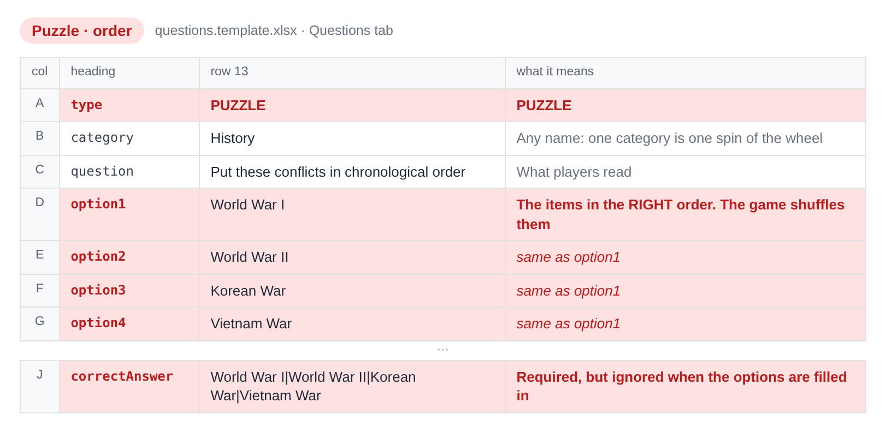

- **Put the options in the correct order**: two or more, all different. The
  game shuffles them for players, and never shows them in the answer order.
- **`correctAnswer` is ignored when the options are filled in**, but it cannot
  be blank.
- **The shorter way:** leave the options empty and write the order in
  `correctAnswer`, joined with `|` or `;` (not commas).

```csv
type,category,question,option1,option2,option3,option4,correctAnswer,explanation
PUZZLE,History,Put these conflicts in chronological order,World War I,World War II,Korean War,Vietnam War,World War I|World War II|Korean War|Vietnam War,By the year each began.
PUZZLE,History,Put these in chronological order,,,,,World War I|World War II|Korean War,By the year each began.
```

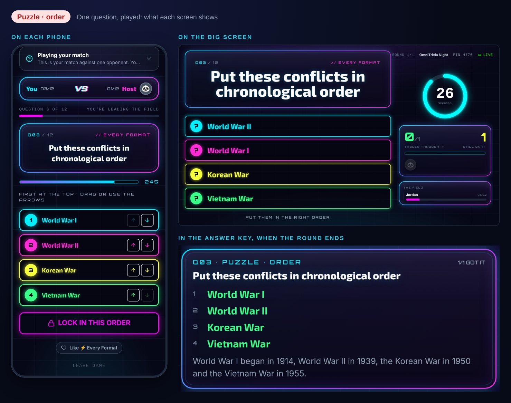

All items must be in the right place to score. `Sort` in the `type` column
means the sort puzzle below, not this one.

### Puzzle · match · `MATCH`

Players tap an item, then its partner. Tapping a paired item frees it.

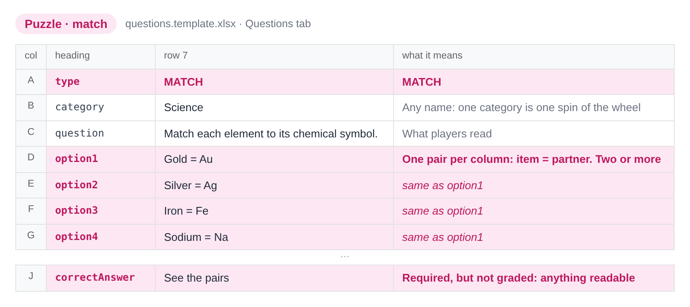

- **Write each pair in its own option column as `item = partner`.** `->`,
  `→`, `=>` and `::` work in place of `=`. The cell is split at the first one,
  so a partner can contain one.
- **Two or more pairs**, every item different and every partner different —
  capitals do not make them different. Six is as many as reads well on a phone.
- **The items keep the file's order on the left; the partners are shuffled**
  on the right.
- **`correctAnswer` is not graded**, but it cannot be blank: `See the pairs`
  will do. Or leave the options empty and put the pairs in `correctAnswer`,
  joined with `|`.

```csv
type,category,question,option1,option2,option3,option4,correctAnswer,explanation
MATCH,Science,Match each element to its chemical symbol.,Gold = Au,Silver = Ag,Iron = Fe,Sodium = Na,See the pairs,
MATCH,Science,Match each element to its chemical symbol.,,,,,Gold = Au|Silver = Ag|Iron = Fe,
```

> [!WARNING]
> **A cell that starts with `=` is a formula** in Excel and Google Sheets, and
> one starting with `+` or `-` is in Excel. Write the item first, the way the
> examples do.

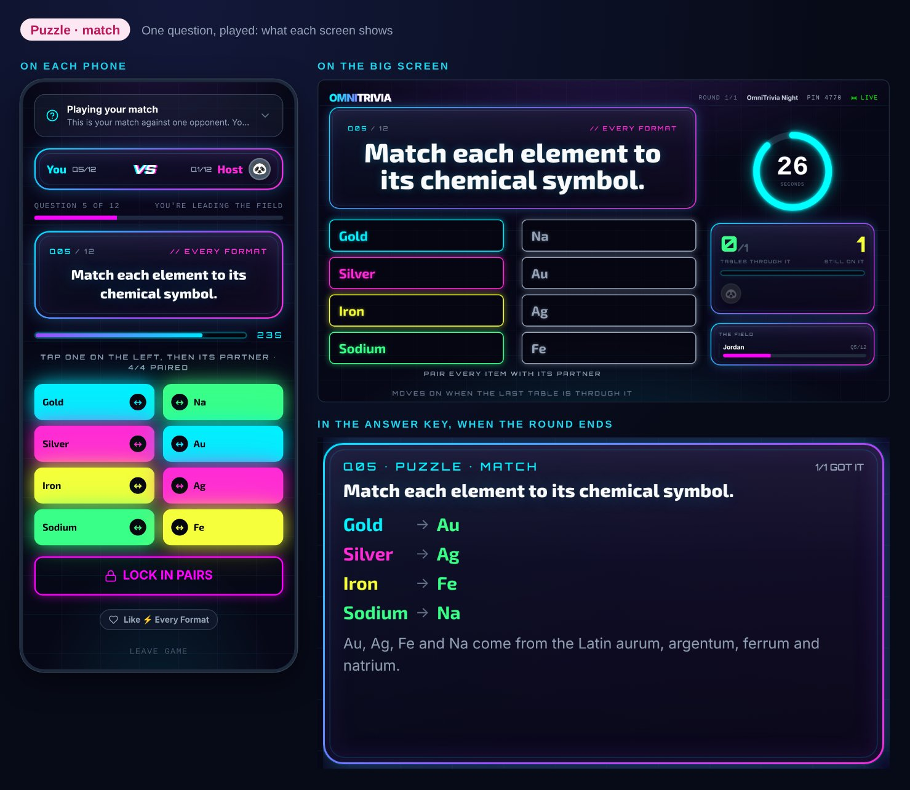

It pays for every pair right beyond what guessing would get: with four pairs,
all four is full points, three is two thirds, two is a third, one is nothing.

### Puzzle · sort · `CATEGORIZE`

Players tap a group for every item, then lock it in.

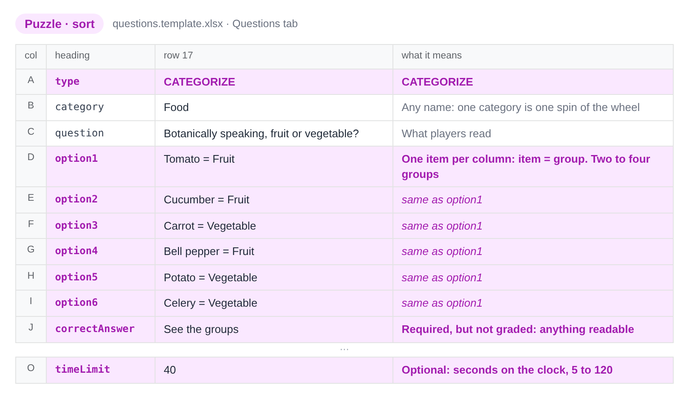

- **Write each item in its own option column as `item = group`**, with **two
  to four groups**. Every item has to be different.
- **Spell each group exactly the same way every time, capitals included.**
  `Fruit` and `fruit` are graded as one group but shown to players as two
  buttons, and a typo makes a new group — a fifth group leaves the question
  out.
- **`correctAnswer` is not graded**, but it cannot be blank: `See the groups`
  will do. Or leave the options empty and put the items in `correctAnswer`,
  joined with `|`.
- **A long sort deserves a longer clock:** put `40` in `timeLimit`.

```csv
type,category,question,option1,option2,option3,option4,option5,option6,correctAnswer,explanation,timeLimit
CATEGORIZE,Food,"Botanically speaking, fruit or vegetable?",Tomato = Fruit,Cucumber = Fruit,Carrot = Vegetable,Bell pepper = Fruit,Potato = Vegetable,Celery = Vegetable,See the groups,,40
```

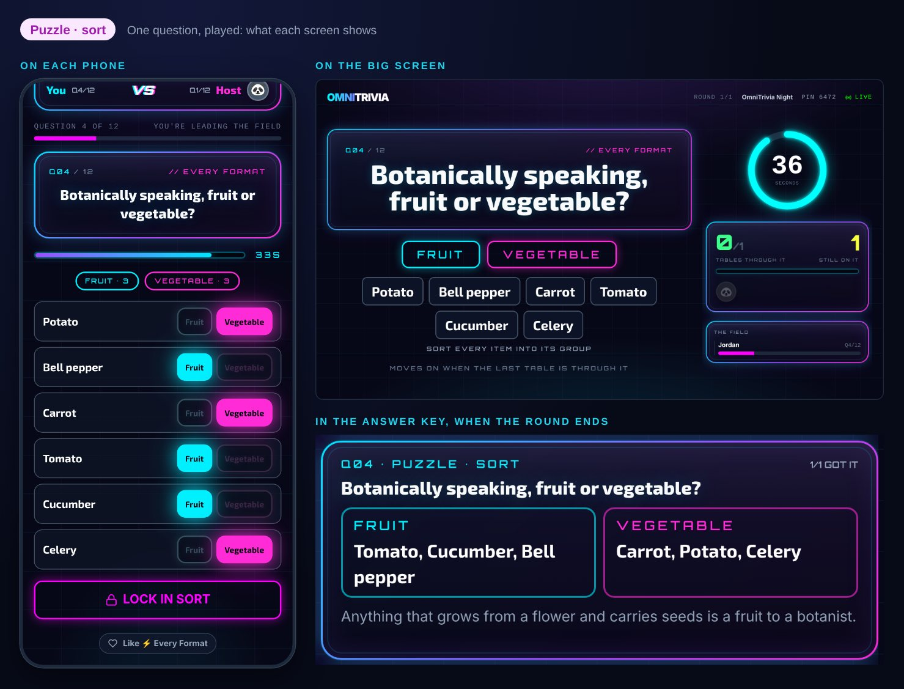

The items are shuffled and the groups shown in alphabetical order. Like a
match, it pays for what is right beyond guessing: with six items in two groups
of three, six right is full points, five is two thirds, four is a third, and
three — everything in one group — is nothing.

> [!TIP]
> **Keep the groups the same size.** With four items in one group and two in
> the other, putting everything in the bigger group still scores a third.

### Puzzle · unscramble · `SCRAMBLE`

Players rebuild a word from its shuffled letters, by tapping tiles or typing.

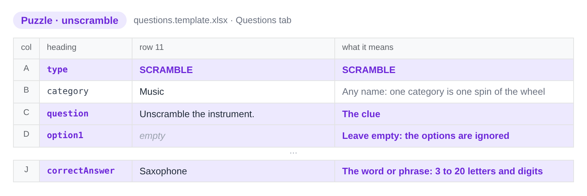

- **`correctAnswer` is the word or short phrase**: 3 to 20 letters and digits.
  Spaces and punctuation are not tiles; accented letters are. The question is
  the clue.
- **The options are ignored.** Leave them empty.
- **The `type` column is required.** With it blank and no options, the row
  becomes a typed-answer question.
- **No brackets:** `Saxophone (instrument)` becomes a 19-letter puzzle.

```csv
type,category,question,correctAnswer,explanation
SCRAMBLE,Music,Unscramble the instrument.,Saxophone,Adolphe Sax patented it in 1846.
```

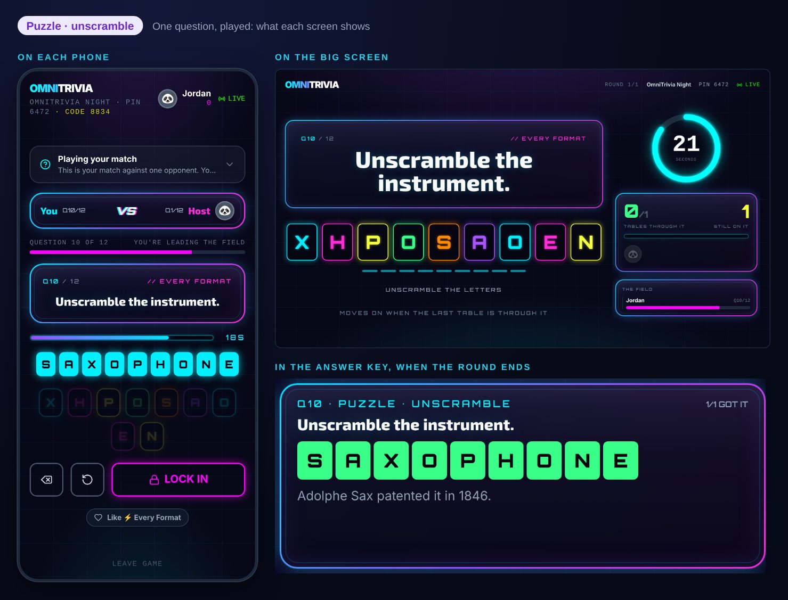

A phrase shows how long each word is (`NEW YORK` is 3 · 4). Capitals, spaces
and punctuation are ignored when it is graded; an accented letter has to be
the accented letter. All or nothing.

## Shorthand: rows with no options

A spreadsheet somebody types by hand rarely fills in four options for every
row, so a row with **every option column empty** and **no `type`** is read
rather than dropped:

| `correctAnswer` | Read as | Notes |
|---|---|---|
| `True` or `False` (exactly) | `TRUE_FALSE` | The two options are the question |
| anything else | `TYPE_ANSWER` | The answer becomes the accepted spelling |

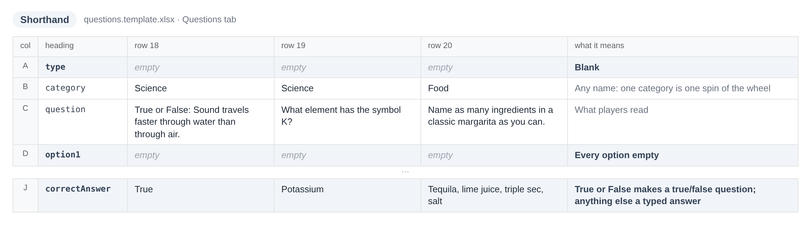

```csv
category,question,option1,option2,option3,option4,correctAnswer,explanation
Science,True or False: Sound travels faster through water than through air.,,,,,True,About four times faster.
Science,What element has the symbol K?,,,,,Potassium,
Food,Name as many ingredients in a classic margarita as you can.,,,,,"Tequila, lime juice, triple sec, salt",
```

For the short-answer case the accepted spellings are worked out from the
answer:

- **The answer exactly as written** — this is what the reveal puts on the big
  screen, so write it for a human reading it out.
- **Each comma- or semicolon-separated item**, so a "name as many as you can"
  question marks a player right for naming one of them rather than wrong for
  not naming all of them. Single letters are not taken on their own, and
  nothing is split when the answer has a number with a decimal point or a
  thousands comma in it.
- **With and without a bracketed gloss**, so `Rum (white rum)` accepts `Rum`
  and `white rum` as well.

> [!TIP]
> Want tighter grading than that? Set `type` to `TYPE_ANSWER` and list exactly
> the spellings you will accept in the option columns — a row that lists them
> is taken at its word. Do this for any answer with a comma that is not a list:
> `Washington, D.C.` would otherwise accept `Washington` on its own.

## A picture on any question

The `image` column works on every format, not just pins: a logo to name, a
painting to date, a flag to place. It is shown above the options on the
phones and the big screen, and `world` or `usa` shows the map instead. Use a
picture that does not give the answer away.

Pictures are loaded straight from their link by every phone and the big
screen, so use a host that allows that. A Google Drive share link is a page,
not a picture, and will not show. A picture that fails to load simply does not
appear, so check each one on the review screen.

## Spreadsheet traps

Excel and Google Sheets change some things as you type them, and the CSV file
carries the changed value.

| You type | The spreadsheet makes it | What to do |
|---|---|---|
| `1968-1970`, `3-5`, `1/2`, `May 4` | a date | Format the column as text first (Sheets: **Format → Number → Plain text**; Excel: **Format Cells → Text**), or start the cell with `'` |
| `1:30` in `timeLimit` | a time, read as 1 second (a 5-second clock) | Write seconds: `90` |
| `007` | `7` | Format as text |
| `= Au`, `+1`, `-5` at the start of a cell | a formula | Write the item first (`Gold = Au`), or start the cell with `'` |
| a long number | `1.23457E+11` | Format as text |
| `3,14` where the decimal mark is a comma | a number the app will not guess at: the question is left out | Use a point: `3.14` |
| `True` | `TRUE` | Nothing — that is fine |

The leading `'` is not saved into the CSV. Two more things that only show up
in the file:

- **No line breaks inside a cell.** The app reads the file a line at a time, so
  a cell with a line break cuts its row off at the break. Its leftover lines
  are left out with a reason, and the rows after it are fine. A tab-separated
  file from Google Sheets is the exception: it puts no quotes around a cell,
  so nothing shows where a cell with a line break ends, and its leftover line
  can import as a question of its own. Its quotation marks are dropped too
  (`"Hey Jude" was…` reads `Hey Jude was…`). Download a CSV when cells hold
  line breaks or quotes.
- **Quotes are fine.** A spreadsheet saves a cell like `the "quiet" one` as
  `"the ""quiet"" one"`, and the app reads it back with its quotes.

## Checking your file

After the import, **WHAT TO PLAY** lists every category and how many
questions it has. A row that cannot be played is left out, never guessed at,
and the screen says how many were left out and why — "3 questions were left
out automatically (2 — the answer matches none of the options, 1 with
placeholder answers)". The first few row numbers are written to the browser's
console.

| Reason shown | What to fix |
|---|---|
| missing category, question or answer | One of the three required cells is empty. For formats that ignore the answer, write something in it anyway |
| a number reads two ways — write it with a decimal point and no thousands separator | A decimal comma (`26,6406`), a band written with a comma (`1968,1970`), or, in a file separated by semicolons or tabs, any comma in a number, and with semicolons a point before three digits |
| unknown format "…" | The `type` cell names no format. Use a name from the table under **Choosing a format**, the template's drop-down, or leave it blank |
| the answer matches none of the options | `correctAnswer` is not one of the options, or could mean two. Also the sign of a select-all with a blank `type` |
| an answer matches none of the options | One of a select-all's answers is not an option |
| the answer is an option's letter or number — write the option itself | `correctAnswer` says `B` or `2` instead of the option's text |
| true/false answer is neither True nor False | Use True or False (or T/F, Yes/No) |
| with placeholder answers / placeholder question | Filler text like `Option B`, `TBD`, `Placeholder` |
| no accepted answer / no correct answer | Every spelling or answer given is filler |
| with no options to choose from | Too few options left: two for multiple choice, three for select-all, two items for an order puzzle |
| slider is missing its scale / range is missing its scale | Lowest, highest or step is missing or unreadable, highest is not above lowest, or `option4` is above `option5` |
| the answer is off the scale | The target sits outside the lowest–highest range |
| no numeric answer | A closest-number answer with no number in it |
| no picture to pin | No `image`, or a link in `option1` with digits in it |
| pin target is missing | The latitude/longitude or across/down numbers are missing |
| pin target is off the map / off the picture | A spot outside the map, or a percent over 100 |
| every option needs an "item = partner" pair | A match or sort option without `=` (or `->`, `→`, `=>`, `::`) |
| no pairs | Fewer than two pairs or items |
| two items are the same / two items share a partner | Duplicates, ignoring capitals |
| a sort needs two to four groups | Too many group names — often a typo or a capital letter |
| no word to scramble / a scramble needs 3 to 20 letters / nothing to unscramble | The unscramble answer is filler, too short or long, or all one letter |

Then the review screen lists every round and question with its format, its
clock and its answer — drawn, for the formats that have something to draw: a
ring on the map, a band on the slider's scale, the order, the pairs, the
groups, the tiles. Read it before opening the lobby: it is the last point
where a typo is cheap to fix.

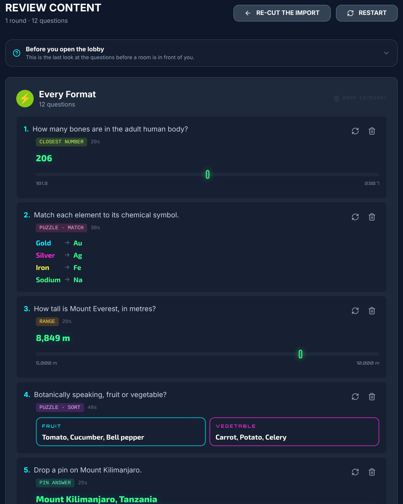

## Keeping the template and the pictures current

For anyone changing a format or the example file:

- **`questions.example.csv` is the source.** The template's Questions tab is
  built from it: `python3 scripts/generate-template.py` (needs `openpyxl`;
  `--preview` also redraws the template picture, with LibreOffice).
- **The pictures are drawn from it too:** `node scripts/generate-format-images.mjs`
  plays a real game in a headless browser (needs Playwright — see the script's
  header).
- **`npm run check-question-types`** checks every format against the app's own
  importer, grader and answer-hiding. It also checks three things this guide
  depends on: `questions.example.csv` still covers every format with nothing
  left out, the template still matches it cell for cell, and every CSV example
  above imports, with nothing left out, as the format its section names.
